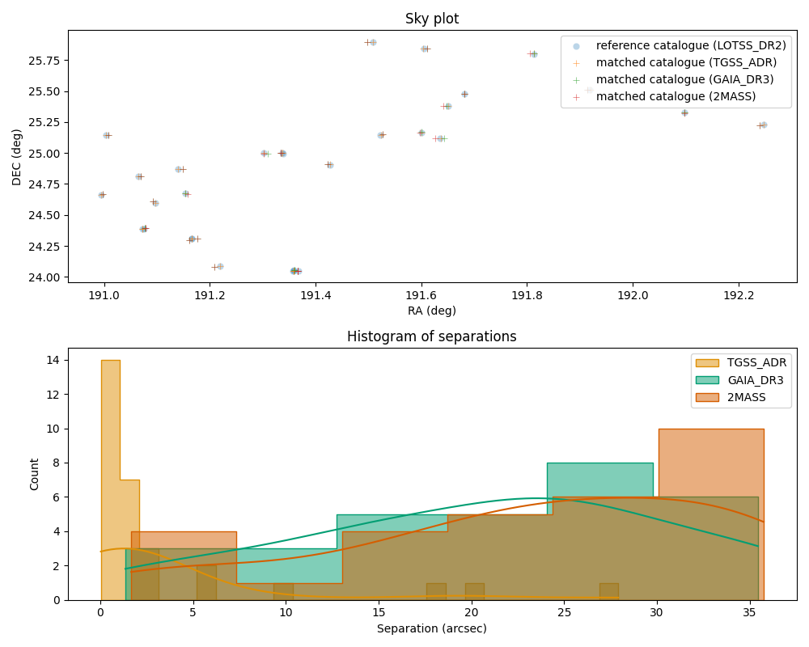

# CANFAR cross-matching task

ℹ️ This development has been customised to run on [CANFAR](https://github.com/opencadc/science-containers/tree/main) platform.

This task cross-matches >=2 catalogues using IVOA Simple Cone Search (SCS) services. It is currently set up to acces the following catalogues: 
- LoTSS_DR2
- GMRT_ADR
- GAIA_DR3
- 2MASS

## How to run the task

Clone this repository and add execute permissions to files in the repository:

```bash
    $ chmod 755 -R *
```

The run.sh script will pull the latest container from the registry 
(no building is required) and executing the task.

```bash
    $ ./run.sh
```

or alternatively using the Makefile targets if Make is installed:

```bash
    $ make run
```

for running using an image from the remote registry, or 

```bash
    $ make run-local
```

for running using an image from your machine's local registry.

## How to use a Jupyter notebook interactively

To use a Jupyter notebook environment, first make the image:

```bash
    $ make image-jupyter
```

run it:

```bash
    $ make run-local-jupyter
```

and then navigate to the url it displays in the terminal.

An example notebook, `crossmatching.ipynb` is available in the default notebook directory, `jupyter/notebooks`.

## Expected outputs

If the crossmatching was successful a catalogue will be written in fits format /scripts/crossmatch_cat.fits. A 2D sky plotw will also be made of the crossmatched sources along with a histogram of the separations for each matching catalogue, e.g.

{width=75%}

## Adding catalogues

If an IVOA SCS interface exists to the catalogue you want to add, add a new entry in `scripts/catalogue.py` with the 
URL to the service, `SCS_URL`, and also specifying which columns correspond to RA/DEC (and optionally their errors), 
e.g. 

```python
class CatalogueNew(Catalogue):
    """ Gaia DR3 Catalogue. """
    SCS_URL = "https://path/to/some/catalogue/scs.xml"
    _RA_COLUMN = 'ra'
    _DEC_COLUMN = 'dec'
    _ERR_RA_COLUMN = 'ra_error'
    _ERR_DEC_COLUMN = 'dec_error'
```

and then add it to the list of `SUPPORTED_CATALOGUES` in `scripts/crossmatch.py`:

```python
SUPPORTED_CATALOGUES = {
    ...,
    'NEW_CATALOGUE': CatalogueNew
}
```

It can then be referenced by the name `NEW_CATALOGUE` in either the `--ref-catalogue` or `--match-catalogue` arguments.
